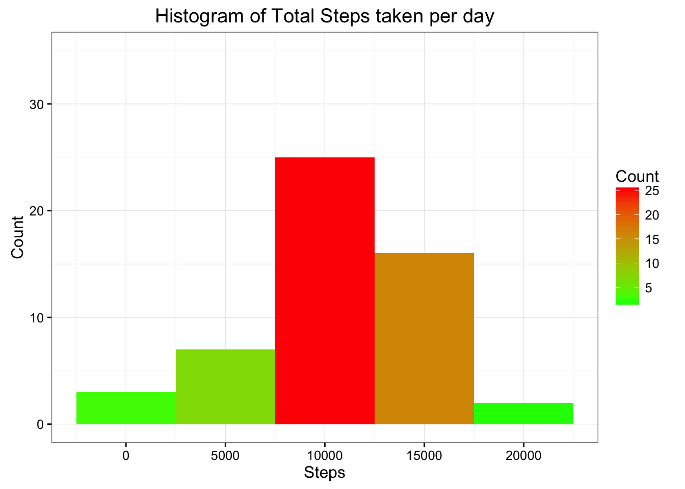
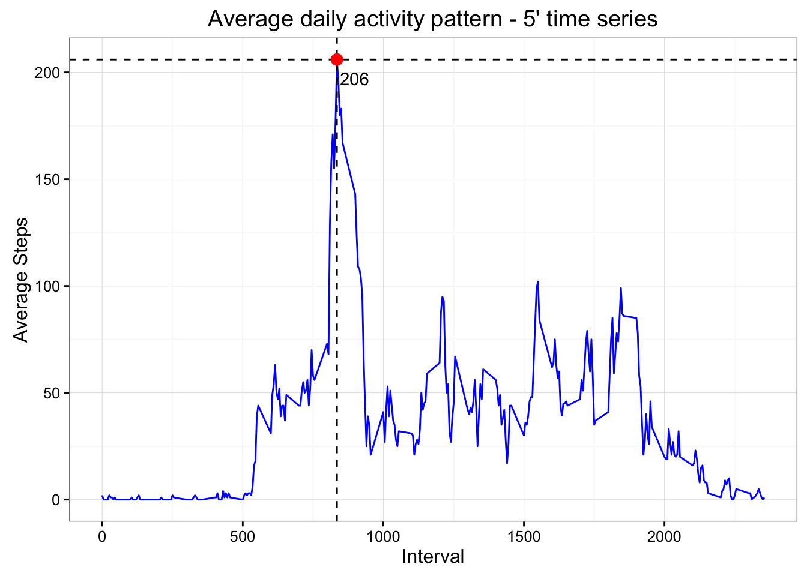
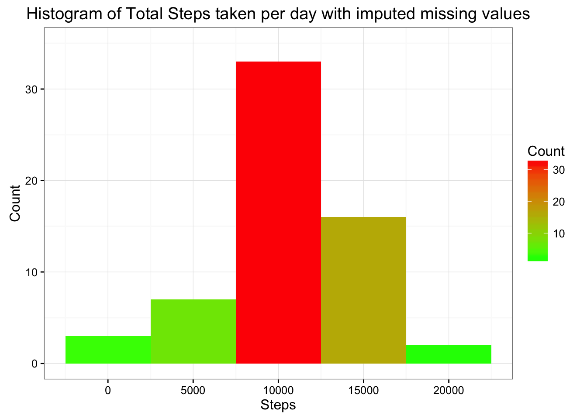
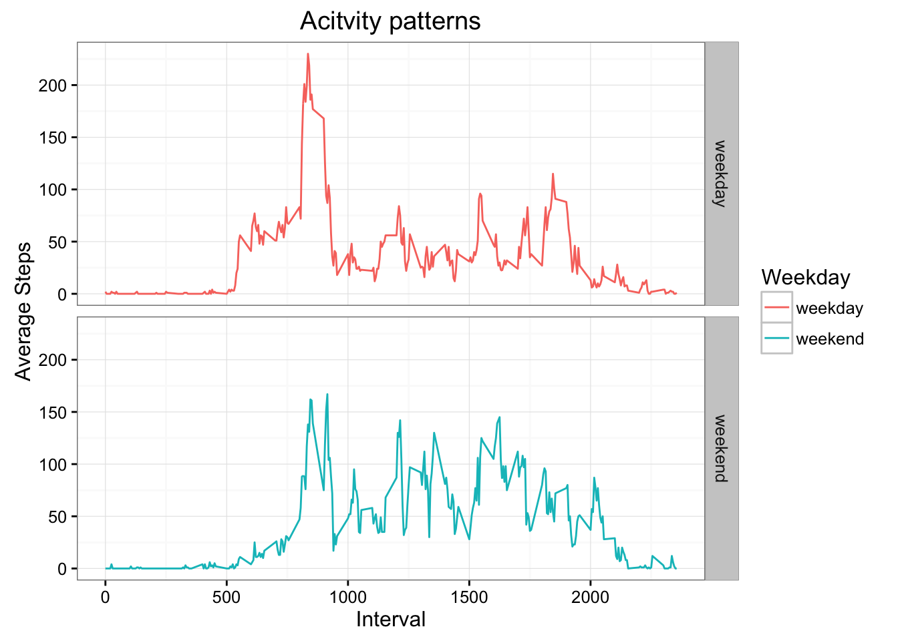

Common setup and load all packages required in this assignment.


All files from the repo should be copied to the working directory and executed from there.
Data used in this assignment have been downloaded from the [Coursera Reproducible Research Website][1].

This assignment makes use of data from a personal activity monitoring device. This device collects data at 5 minute intervals through out the day. The data consists of two months of data from an anonymous individual collected during the months of October and November, 2012 and include the number of steps taken in 5 minute intervals each day.

The variables included in this dataset are:

- steps: Number of steps taking in a 5-minute interval (missing values are coded as NA)
- date: The date on which the measurement was taken in YYYY-MM-DD format
- interval: Identifier for the 5-minute interval in which measurement was taken

The dataset is stored in a comma-separated-value (activity.csv) file and there are a total of 17,568 observations in this dataset.

## Loading and preprocessing the data


```r
unzip("activity.zip")
activity <- read.csv("activity.csv", header = TRUE, stringsAsFactors = FALSE)
activity$date <- as.Date(activity$date)
```

## What is mean total number of steps taken per day?


```r
steps_by_day <- with(activity, aggregate(steps ~ date, FUN = sum, rm.na = TRUE))
g <- ggplot(steps_by_day, aes(steps)) 
g + geom_histogram(aes(fill = ..count..), binwidth = 5000) +
    scale_fill_gradient("Count", low = "green", high = "red") + 
    labs(title="Histogram of Total Steps taken per day") +
    labs(x="Steps", y="Count") + 
    ylim(0,35) +
    theme_bw()
```




```r
med = median(steps_by_day$steps)
mn = as.integer(round(mean(steps_by_day$steps), digits = 0))
```

The median of total number of steps taken per day is 10766 and the mean is 10767.

## What is the average daily activity pattern?


```r
steps_by_interval <- with(activity, aggregate(steps ~ interval, FUN = mean, rm.na = TRUE))
max_interval = which.max(steps_by_interval$steps)
interval = steps_by_interval$interval[max_interval]
max_steps = round(steps_by_interval$steps[max_interval], digits = 0)
steps_by_interval$steps <- round(steps_by_interval$steps, digits = 0)
g <- ggplot(steps_by_interval, aes(interval, steps)) 
g + geom_line(col = "blue") + 
    labs(title="Average daily activity pattern - 5' time series") +
    geom_vline(xintercept = interval, col = "black", linetype = 2) +
    geom_hline(yintercept = max_steps, col = "black", linetype = 2) +
    labs(x="Interval", y="Average Steps") + 
    geom_point(data = steps_by_interval[max_interval, ], col = "red", size = 3) +
    geom_text(aes(label=ifelse(steps_by_interval$steps == max_steps, round(steps_by_interval$steps, digits = 0), ""),hjust=-0.1, vjust=2)) +
    xlim(0, 2355) +
    theme_bw()
```



The interval 835 contains on average maximum number of steps (206).

## Imputing missing values


```r
missing_values = sum(is.na(activity$steps))
missing_values_ratio = round(missing_values/nrow(activity)*100, digits = 1)
```

There are 2304 in the actvity.csv dataset which gives a proportion of 13.1 %.

To check if the missing values bias calcluations, the missing values have been imputed using the mean for the corresponding 5-minute interval. Thus, if interval 5 was missing for 05-10-2012, the value was set to the mean for this interval for all days.

The new data set activity_imputed is created which will be used to compare calculation with the first part of thi assignment.


```r
activity_imputed <- copy(activity)
impute.mean <- function(x) replace(x, is.na(x), mean(x, na.rm = TRUE))
setDT(activity_imputed)
activity_imputed[, steps := as.integer(round(impute.mean(steps), digits = 0)), by = interval]
```

Now, let's create the histogram of total number of steps taken each day.


```r
steps_by_day_imp <- with(activity_imputed, aggregate(steps ~ date, FUN = sum, rm.na = TRUE))
steps_by_day_counts <- 
g <- ggplot(steps_by_day_imp, aes(steps)) 
g + geom_histogram(aes(fill = ..count..), binwidth = 5000) +
    scale_fill_gradient("Count", low = "green", high = "red") + 
    labs(title="Histogram of Total Steps taken per day with imputed missing values") +
    labs(x="Steps", y="Count") + 
    ylim(0,35) +
    theme_bw()
```



The plot looks similar to the first one where the missing values were not imputed. The main difference is increase in the count of total daily number of steps between 7500 and 12500.


```r
med_imp = median(steps_by_day_imp$steps)
mn_imp = as.integer(round(mean(steps_by_day_imp$steps), digits = 0))
```

The median of total number of steps taken per day with imputed missing values is 10763 and the mean is 10767. The values do not differ too much from the previous values, the median is slightly lower, the mean is the same. In this example imputing of the values does not have much impact on the analysis. 

However, we could find a more sophisticated way of imputing missing values, for instance take into account trends in the data (increasing) and also the fact all the values were missing for 01-10-2012 - we could exclude this day from calculations for instance.

## Are there differences in activity patterns between weekdays and weekends?

Let's analyse now if there are differences in activity patterns between weekdays and weekends.


```r
weekdays = c("Monday", "Tuesday", "Wednesday", "Thursday", "Friday")
activity_imputed$day <- weekdays(activity_imputed$date)
activity_imputed$wd_we <- ifelse(activity_imputed$day %in% weekdays, "weekday", "weekend")
activity_imputed$wd_we <- as.factor(activity_imputed$wd_we)
steps_by_wday <- with(activity_imputed, aggregate(steps ~ wd_we + interval, FUN = mean, rstepm.na = TRUE))
steps_by_wday$steps <- round(steps_by_wday$steps, digits = 0)
g <- ggplot(steps_by_wday, aes(interval, steps)) 
g + geom_line(aes(color = wd_we)) + 
    scale_colour_discrete(name="Weekday") +
    labs(title="Acitvity patterns") +
    labs(x="Interval", y="Average Steps") + 
    facet_grid(wd_we ~ .) + 
    theme_bw()
```



The plot indicates that there is on average less activity during the weekend, especially on itervals 0 to around 800. Then, there is slightly more activity on the weekends on the intervals about 800.


References:

[1]: https://www.coursera.org/learn/reproducible-research/peer/gYyPt/course-project-1 [Coursera Reproducible Research Website]
